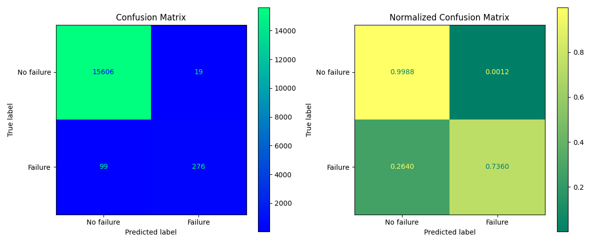

# Modelisation

---
[Presentation](#presentation) | [Recover](#recover-the-project) | [Distribution](#gitlab-distribution) | [Random Forest](#random-forest)

---

&nbsp; 


</div>

## Presentation

**Context** : Predict air pressure system failures in Scania trucks.

**Project Recapitulation**: 👇

The aim of this project is to utilize data from a truck company regarding various breakdowns across different trucks to develop a model (AI) capable of predicting potential failures. The model will be trained on the available data to classify whether a truck might experience a breakdown based on its specific information.

## Recover the project

To retrieve the project via a terminal use the command:

```git clone https://codefirst.iut.uca.fr/git/arthur.valin/Modelisation.git```

Then go to the folder:

```cd src```

And finally run the index.py file:

```python3 index.py```

Currently in the master there is only the random forest, if you wish to test the kNN model:

```git checkout kNN ```

## Gitlab Distribution

The root of our Gitlab consists of two essential folders for the project:

[**src**](src) : **Application code**

[**data**](data) : **Used data**

[**doc**](doc) : **Project Documentation** (Doxygen)

Dataset: [**scania**](https://www.kaggle.com/code/percevalve/scania-dataset-eda-for-histograms/notebook)

## Random Forest

The most accurate solution, with more than 99% accuracy and good decision, is the random forest, with the following confusion matrix:



## Authors

- Emre KARTAL : emre.kartal@etu.uca.fr
- Arthur VALIN : arthur.valin@etu.uca.fr


<div align = center>
© PM1
</div>
